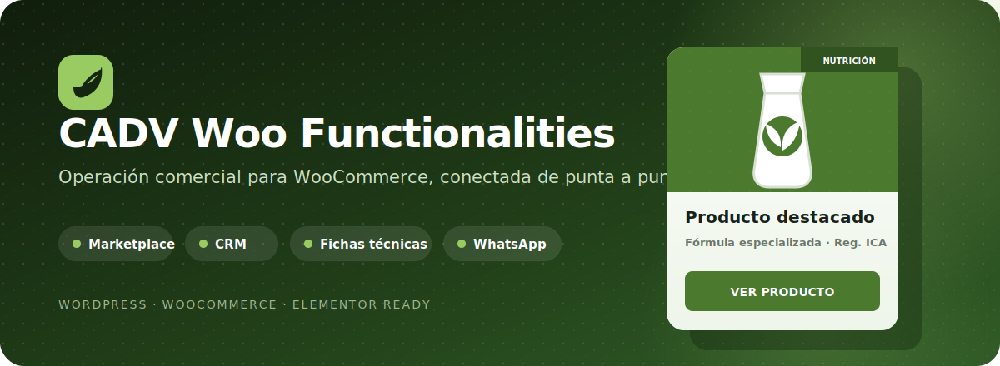
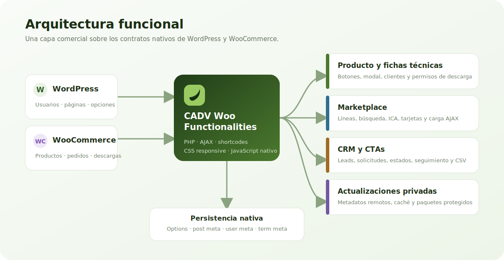
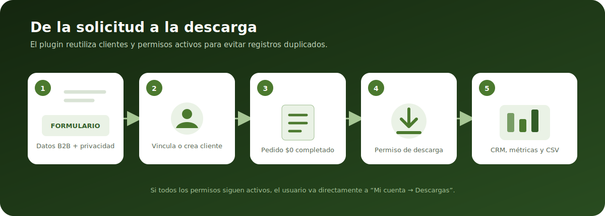

<p align="center">
  
</p>

<p align="center">
  
  
  
  
</p>

# CADV Woo Functionalities

Plugin privado para convertir una instalación de WooCommerce en una plataforma comercial B2B: catálogo filtrable, solicitudes de fichas técnicas, captación de leads, CRM operativo, CTAs para Elementor, contacto por WhatsApp y actualizaciones controladas desde un servidor propio.

El plugin utiliza productos, categorías, usuarios, pedidos y permisos de descarga nativos de WooCommerce. No requiere una base de datos paralela ni un framework JavaScript adicional.

## Contenido

- [Capacidades principales](#capacidades-principales)
- [Requisitos](#requisitos)
- [Instalación](#instalación)
- [Configuración inicial](#configuración-inicial)
- [Fichas técnicas](#fichas-técnicas)
- [CRM comercial](#crm-comercial)
- [Marketplace](#marketplace)
- [CTAs y formularios](#ctas-y-formularios)
- [WhatsApp](#whatsapp)
- [Referencia de shortcodes](#referencia-de-shortcodes)
- [Importación y exportación de productos](#importación-y-exportación-de-productos)
- [Portal del cliente](#portal-del-cliente)
- [Actualizaciones privadas](#actualizaciones-privadas)
- [Arquitectura y datos](#arquitectura-y-datos)
- [Seguridad y privacidad](#seguridad-y-privacidad)
- [Desarrollo](#desarrollo)
- [Solución de problemas](#solución-de-problemas)

## Capacidades principales

| Módulo | Qué resuelve |
| --- | --- |
| Fichas técnicas | Solicita datos B2B, crea o vincula el cliente y concede acceso a los descargables del producto. |
| Marketplace | Muestra productos por línea comercial con búsqueda, filtro ICA, carga progresiva y colores de categoría. |
| CRM | Centraliza solicitudes, leads, clientes, descargas, seguimientos y solicitudes de eliminación. |
| CTAs | Captura cotizaciones, newsletter y solicitudes de servicios sin crear usuarios ni pedidos. |
| WhatsApp | Genera botones o URL dinámicas con mensajes configurables y variables de página/producto. |
| Portal de cliente | Restringe la cuenta de clientes creados por el plugin a descargas y datos esenciales. |
| Actualizador privado | Integra nuevas versiones con el sistema nativo de actualizaciones de WordPress. |

<p align="center">
  
</p>

## Requisitos

- WordPress 6.0 o superior.
- PHP 7.4 o superior.
- WooCommerce activo.
- Enlaces permanentes y página `Mi cuenta` de WooCommerce configurados.
- Una página de Política de Privacidad, recomendada para todos los formularios públicos.
- HTTPS en producción, especialmente si se habilitan actualizaciones privadas.

> Las versiones de WordPress y PHP corresponden a los valores de distribución incluidos en `update-server/config.example.php`.

## Instalación

1. Crea un ZIP cuya carpeta raíz sea `cesarandev-woo-func` o la carpeta definitiva del plugin.
2. En WordPress ve a **Plugins → Añadir plugin → Subir plugin**.
3. Instala el ZIP y activa **CADV Woo Functionalities**.
4. Confirma que WooCommerce esté activo.
5. Abre **WooCommerce → CADV Woo Functionalities** para completar la configuración global.

También puedes copiar la carpeta directamente a:

```text
wp-content/plugins/cesarandev-woo-func/
```

## Configuración inicial

### 1. Configurar WhatsApp

Ve a **WooCommerce → CADV Woo Functionalities** y completa:

- **Número de WhatsApp:** código de país y número, únicamente dígitos. Ejemplo: `573001234567`.
- **Mensaje automático:** plantilla usada en el producto individual y en cualquier shortcode sin mensaje personalizado.

Variables admitidas en la plantilla global:

- `{product_name}`: nombre del producto.
- `{product_url}`: URL del producto.

Mensaje predeterminado:

```text
Hola, estoy viendo el producto {product_name} en la pagina web y quisiera mas informacion. {product_url}
```

### 2. Preparar las líneas comerciales

1. Ve a **Productos → Categorías**.
2. Crea cada línea comercial como categoría de nivel superior.
3. Edita la categoría y selecciona su **Color en marketplace**.
4. Usa subcategorías cuando necesites familias más específicas; el plugin normaliza cada producto a su categoría raíz.

Si una línea no tiene color configurado, se usa `#203212`.

### 3. Preparar los productos

En **Productos → Editar producto → Datos del producto → General** puedes completar:

- **Segmento**.
- **Tipo**.
- **Registro ICA**.
- **Descripción comercial-técnica**.

Además:

1. Asigna el producto a una línea comercial.
2. Define una imagen destacada.
3. Marca el producto como descargable y agrega uno o más archivos si ofrecerá ficha técnica.

### 4. Crear las páginas

Página principal del marketplace:

```text
[cadv_marketplace]
```

Buscador externo, por ejemplo en la portada:

```text
[cadv_marketplace_search target="/marketplace/"]
```

## Fichas técnicas

### Comportamiento en la página del producto

En un producto individual el plugin agrega dos acciones comerciales:

- **Consultar por WhatsApp**, si existe un número configurado.
- **Obtener ficha técnica**, si el producto tiene archivos descargables.

Cuando el producto no tiene descargables, se muestra el botón deshabilitado **Sin ficha existente**.

También puedes controlar la ubicación desde Elementor o el editor usando:

```text
[cadv_ficha_tecnica]
```

Fuera del contexto de un producto:

```text
[cadv_ficha_tecnica product_id="123"]
```

Alias heredado compatible:

```text
[cesarandev_ficha_tecnica product_id="123"]
```

### Datos solicitados

El modal solicita:

- Nombre completo.
- Empresa.
- Cargo.
- Correo electrónico.
- Teléfono.
- Aceptación de la Política de Privacidad y del tratamiento de datos.

Si el cliente inició sesión, se precargan sus datos y el correo queda bloqueado para evitar asociar la solicitud a otra cuenta.

### Flujo interno

<p align="center">
  
</p>

1. Se valida el nonce, el formulario y la existencia del producto.
2. Se usa el cliente autenticado, se busca un usuario por correo o se crea un cliente WooCommerce.
3. Se actualizan los datos B2B del cliente.
4. Si ya posee permisos activos para todos los archivos, no se duplica la solicitud.
5. Si necesita acceso, se crea un pedido de valor cero, se marca como completado y WooCommerce genera los permisos de descarga.
6. La solicitud queda disponible en el CRM.
7. Los clientes autenticados reciben un correo cuando se concede una ficha nueva.

Los clientes nuevos reciben la notificación estándar de creación de cuenta de WooCommerce y pueden entrar a **Mi cuenta → Descargas**.

## CRM comercial

Disponible en **WooCommerce → CRM Fichas Técnicas** para usuarios con la capacidad `manage_woocommerce`.

### Dashboard

Resume:

- Solicitudes registradas.
- Leads CTA.
- Clientes.
- Fichas diferentes.
- Descargas totales.
- Fichas sin descargar.
- Leads convertidos.
- Eliminaciones pendientes.

### Solicitudes

Permite consultar y filtrar por cliente, correo, empresa, cargo, teléfono, producto, fechas, estado CRM, estado de descarga, mínimo de descargas y estado de eliminación.

Cada solicitud puede actualizar:

- Estado CRM.
- Próxima fecha de seguimiento.
- Nota interna.
- Estado de la solicitud de eliminación.

Estados disponibles:

| Clave | Etiqueta |
| --- | --- |
| `new` | Nuevo |
| `contacted` | Contactado |
| `interested` | Interesado |
| `follow_up` | Seguimiento |
| `closed` | Cerrado |
| `not_interested` | No interesado |
| `converted` | Convertido |
| `delete_request` | Solicitud de eliminación |

### Leads / CTAs

Los formularios de cotización, servicios y newsletter actualizan un lead por correo electrónico. Cada contacto conserva el historial de tipos de CTA e interacciones, la fuente, el interés, el cultivo y la última fecha de contacto.

Filtros disponibles:

- Nombre, correo o empresa.
- Tipo de CTA.
- Estado CRM.
- Producto o servicio de interés.
- Fecha de demostración AgroPilot.
- Tipo de cultivo.
- Fuente.
- Conversión a usuario.
- Rango de fechas.

Cuando un lead solicita posteriormente una ficha técnica con el mismo correo, el plugin reutiliza sus datos faltantes y marca el lead como convertido.

### Clientes y eliminaciones

La pestaña **Clientes** agrupa solicitudes y descargas por usuario. La pestaña **Eliminaciones** concentra las solicitudes pendientes creadas desde el portal del cliente.

### Exportación CSV

El botón **Descargar CSV filtrado** conserva los filtros activos. El archivo puede incluir solicitudes de fichas, leads o ambos, con datos de contacto, interés, descargas, CRM, seguimiento, eliminación y conversión.

## Marketplace

El marketplace usa categorías padre de producto como líneas comerciales.

```text
[cadv_marketplace]
```

Configuración completa:

```text
[cadv_marketplace per_page="12" columns="3" show_ica_filter="yes"]
```

| Atributo | Predeterminado | Valores |
| --- | --- | --- |
| `per_page` | `12` | Entre `1` y `48`. |
| `columns` | `3` | Entre `1` y `4`; el diseño adapta las columnas en tablet y móvil. |
| `show_ica_filter` | `yes` | `yes`, `true`, `1`, `on` o `si` para mostrarlo. |

### Tarjetas

Cada tarjeta muestra, cuando existe:

- Línea comercial.
- Imagen destacada en tamaño completo y con ajuste proporcional.
- Nombre del producto.
- Tipo.
- Registro ICA.
- Descripción comercial-técnica limitada a 16 palabras.
- Enlace al producto.

El área visual combina cuatro capas independientes:

1. Color configurado de la línea.
2. Textura decorativa local al `50%` de opacidad (`opacity: 0.5`).
3. Suelo y follaje decorativo en WebP con transparencia real, anclado en la base de la tarjeta.
4. Imagen del producto al `100%`.

La descripción usa este orden de respaldo: descripción comercial-técnica, descripción corta y descripción completa.

### Filtros y carga

- Línea comercial, incluyendo productos de sus subcategorías.
- Productos con Registro ICA.
- Búsqueda con retardo para evitar peticiones por cada pulsación.
- Carga progresiva mediante **Cargar más**.
- Panel de filtros compacto en móvil.
- Respuesta AJAX disponible para usuarios autenticados y visitantes.

La búsqueda revisa:

- Título, contenido y extracto.
- Segmento, tipo, descripción comercial-técnica y Registro ICA.
- SKU.
- Categorías, líneas, subcategorías y etiquetas.

Los resultados se ordenan por `menu_order` y título.

### Filtros desde URL

El marketplace reconoce estos parámetros y alias:

| Propósito | Parámetros admitidos |
| --- | --- |
| Búsqueda | `cadv_search`, `buscar`, `busqueda`, `search`, `q` |
| Línea | `cadv_line`, `linea`, `line`, `categoria`, `category`, `product_cat` |
| Registro ICA | `cadv_ica`, `ica`, `registro_ica`, `has_ica` |

La línea puede indicarse por ID, slug o nombre visible:

```text
/marketplace/?cadv_line=nutricion&cadv_ica=1&cadv_search=palma
```

### Buscador externo

```text
[cadv_marketplace_search target="/marketplace/" placeholder="Buscar soluciones para su cultivo..."]
```

| Atributo | Descripción |
| --- | --- |
| `target` | URL de la página que contiene `[cadv_marketplace]`. Si se omite, usa la página actual y luego la portada. |
| `placeholder` | Texto mostrado dentro del buscador. |

## CTAs y formularios

El shortcode `[cesarandev_crm_cta]` admite tres tipos:

```text
[cesarandev_crm_cta type="quote"]
[cesarandev_crm_cta type="services"]
[cesarandev_crm_cta type="newsletter"]
```

Los formularios crean o actualizan leads en el CRM. No crean usuarios ni pedidos WooCommerce.

### Campos por tipo

| Tipo | Campos obligatorios | Campos adicionales |
| --- | --- | --- |
| `quote` | Nombre, empresa, cargo, teléfono, correo y privacidad | Familia de producto y cultivo. |
| `services` | Nombre, empresa, cargo, teléfono, correo, servicio y privacidad | Cultivo; fecha obligatoria para AgroPilot. |
| `newsletter` | Nombre, correo y privacidad | Empresa opcional. |

La lista de familias de la cotización se obtiene de las categorías de producto WooCommerce.

### Servicios disponibles

| Clave | Servicio |
| --- | --- |
| `agropilot` | AgroPilot — Servicio de dron agrícola |
| `analisis` | Análisis de suelo y foliar |
| `asesoria` | Asesoría agronómica en campo |
| `fertilizacion` | Plan de fertilización personalizado |

Para AgroPilot aparece un calendario obligatorio. La fecha permitida va desde el día actual hasta la misma fecha del siguiente mes calendario, ajustada al último día disponible cuando sea necesario.

### Personalización

```text
[cesarandev_crm_cta
  type="quote"
  title="Solicitar cotización"
  eyebrow="Hablemos de su cultivo"
  description="Cuéntenos qué necesita y le responderemos."
  privacy_url="/politica-de-privacidad/"
]
```

| Atributo | Descripción |
| --- | --- |
| `type` | `quote`, `services` o `newsletter`; admite alias en español. |
| `mode` | `form`, `url`, `link` o `modal`. |
| `service` | Servicio preseleccionado cuando `type="services"`. |
| `title` | Título del formulario. |
| `eyebrow` | Etiqueta superior. |
| `description` | Texto introductorio. |
| `privacy_url` | Política de privacidad alternativa. |

### Elementor: URL dinámica

En el campo **Enlace** de un botón usa la etiqueta dinámica **Shortcode**:

```text
[cesarandev_crm_cta type="quote" mode="url"]
```

Servicios con selección inicial:

```text
[cesarandev_crm_cta type="services" mode="url" service="agropilot"]
[cesarandev_crm_cta type="services" mode="url" service="analisis"]
[cesarandev_crm_cta type="services" mode="url" service="asesoria"]
[cesarandev_crm_cta type="services" mode="url" service="fertilizacion"]
```

Cada servicio obtiene un ID de modal independiente, por lo que pueden coexistir varios botones en una página.

Si Elementor no permite shortcodes como URL, inserta un widget **Shortcode** invisible:

```text
[cesarandev_crm_cta type="quote" mode="modal"]
```

Luego enlaza el botón a:

```text
#cesarandev-crm-cta-quote
```

Para servicios sin preselección usa `#cesarandev-crm-cta-services`. Cuando existe un servicio preseleccionado, el fragmento agrega su clave, por ejemplo `#cesarandev-crm-cta-services-agropilot`.

## WhatsApp

Botón independiente:

```text
[cesarandev_whatsapp
  message="Hola, me interesan los servicios de AgroBrokers."
  text="Hablar por WhatsApp"
]
```

URL dinámica para Elementor:

```text
[cesarandev_whatsapp mode="url" message="Hola, me interesa {page_title}. {page_url}"]
```

Producto específico:

```text
[cesarandev_whatsapp product_id="123" message="Quiero conocer más sobre {product_name}. {product_url}"]
```

| Atributo | Predeterminado | Descripción |
| --- | --- | --- |
| `message` | Vacío | Mensaje personalizado; si está vacío usa la plantilla global o el contexto de la página. |
| `text` | `Escribir por WhatsApp` | Texto visible del botón. |
| `mode` | `button` | Usa `url` o `link` para devolver solamente la URL. |
| `product_id` | `0` | Producto explícito cuando no existe contexto WooCommerce. |

Variables admitidas:

- `{product_name}`
- `{product_url}`
- `{page_title}`
- `{page_url}`

Si no existe un número global configurado, el shortcode no imprime contenido.

## Referencia de shortcodes

| Shortcode | Uso |
| --- | --- |
| `[cadv_ficha_tecnica]` | Acciones de WhatsApp y ficha técnica del producto. |
| `[cesarandev_ficha_tecnica]` | Alias heredado del shortcode anterior. |
| `[cadv_registro_ica]` | Registro ICA del producto; no imprime nada si está vacío. |
| `[cadv_categoria_producto]` | Línea comercial principal del producto. |
| `[cadv_marketplace]` | Marketplace completo. |
| `[cadv_marketplace_search]` | Buscador externo para el marketplace. |
| `[cesarandev_crm_cta]` | Formularios o modales de cotización, servicios y newsletter. |
| `[cesarandev_whatsapp]` | Botón o URL de WhatsApp. |

Los shortcodes de producto aceptan `product_id="123"`. Si el atributo se omite, resuelven primero el objeto global de WooCommerce, la página de producto y la entrada actual.

## Importación y exportación de productos

El plugin amplía el importador y exportador CSV nativo de WooCommerce.

### Columnas personalizadas

| Columna | Destino |
| --- | --- |
| `Segmento` | Campo comercial del producto. |
| `Linea comercial` o `Linea` | Categoría padre usada como línea; se crea si no existe. |
| `Tipo` | Tipo técnico o familia descriptiva. |
| `Descripcion comercial-tecnica` | Descripción del marketplace; rellena la descripción corta si está vacía. |
| `Registro ICA` o `ICA` | Registro mostrado en fichas y filtros. |

Ejemplo de cabeceras:

```csv
Nombre,Segmento,Linea comercial,Tipo,Descripcion comercial-tecnica,Registro ICA,Categorias,Imagenes
```

Las columnas `Categorias` e `Imagenes` siguen usando el comportamiento nativo de WooCommerce.

Al exportar productos, WooCommerce agrega nuevamente las columnas personalizadas. La línea exportada corresponde a la categoría raíz resuelta para el producto.

## Portal del cliente

Los usuarios creados exclusivamente por una solicitud de ficha técnica reciben un portal reducido en **Mi cuenta**:

- Descargas.
- Detalles de la cuenta en modo de solo lectura.
- Cerrar sesión.

Los endpoints de pedidos, direcciones y métodos de pago se redirigen a **Descargas**.

Desde **Detalles de la cuenta** el cliente puede solicitar su eliminación. El plugin:

1. Marca la solicitud como pendiente en el usuario y en sus pedidos de fichas.
2. Cambia el estado CRM a **Solicitud de eliminación**.
3. Agrega una nota a los pedidos.
4. Notifica al correo administrativo del sitio.
5. Expone la solicitud en la pestaña **Eliminaciones** del CRM.

El plugin registra la solicitud; no elimina automáticamente al usuario ni sus datos.

Los clientes que ya tienen pedidos comerciales pagados no se convierten en usuarios de portal restringido durante la migración de solicitudes antiguas.

## Actualizaciones privadas

El cliente de actualización vive en `includes/class-cadv-woo-functionalities-updater.php` y consulta metadatos remotos cada 12 horas como máximo.

### Configurar un sitio

En `wp-config.php`:

```php
define(
	'CADV_WOO_FUNCTIONALITIES_UPDATE_SERVER',
	'https://tu-dominio.com/update-server/index.php?token=TU_TOKEN'
);
```

También puedes usar el filtro:

```php
add_filter(
	'cadv_woo_functionalities_update_server',
	function () {
		return 'https://tu-dominio.com/update-server/index.php?token=TU_TOKEN';
	}
);
```

### Configurar el servidor

1. Sube `update-server/` a un hosting con PHP y HTTPS.
2. Copia `update-server/config.example.php` como `update-server/config.php`.
3. Define un `download_token` largo y privado.
4. Sube el ZIP a `update-server/packages/`.
5. Actualiza `version`, `package_file`, compatibilidad, descripción y `changelog`.
6. No publiques `config.php` ni el token en el repositorio.

### Publicar una versión

1. Incrementa la cabecera `Version` y `CADV_WOO_FUNCTIONALITIES_VERSION` en `cesarandev-woo-func.php`.
2. Genera un ZIP con la carpeta exacta del plugin en la raíz.
3. Sube el ZIP al servidor privado.
4. Actualiza `update-server/config.php`.
5. Comprueba la actualización desde **Escritorio → Actualizaciones**.

El endpoint devuelve versión, URL de descarga, compatibilidad, descripción y changelog. WordPress muestra esos datos en su interfaz nativa de plugins.

Consulta también [`update-server/README.md`](update-server/README.md).

## Arquitectura y datos

### Estructura del repositorio

```text
cesarandev-woo-func.php
├── includes/
│   ├── class-cadv-woo-functionalities.php
│   ├── class-cadv-woo-functionalities-marketplace.php
│   └── class-cadv-woo-functionalities-updater.php
├── assets/
│   ├── css/
│   │   ├── cadv-woo-functionalities.css
│   │   └── cadv-woo-marketplace.css
│   ├── images/
│   │   ├── marketplace-grain-texture.jpg
│   │   └── marketplace-soil-foliage.webp
│   └── js/
│       ├── cadv-woo-functionalities.js
│       └── cadv-woo-marketplace.js
├── docs/assets/
│   ├── cadv-woo-functionalities-hero.svg
│   ├── plugin-architecture.svg
│   └── technical-sheet-flow.svg
└── update-server/
    ├── index.php
    ├── download.php
    ├── config.example.php
    └── packages/
```

### Persistencia relevante

| Tipo | Clave | Uso |
| --- | --- | --- |
| Option | `cadv_woo_functionalities_whatsapp_phone` | Número global de WhatsApp. |
| Option | `cadv_woo_functionalities_message_template` | Plantilla global del mensaje. |
| Term meta | `_cadv_marketplace_color` | Color de la línea comercial. |
| Product meta | `_cadv_marketplace_segment` | Segmento. |
| Product meta | `_cadv_marketplace_product_type` | Tipo. |
| Product meta | `_cadv_marketplace_commercial_technical_description` | Descripción comercial-técnica. |
| Product meta | `_cadv_marketplace_ica_registration` | Registro ICA. |
| Hidden post type | `cesarandev_wf_lead` | Leads e interacciones de CTAs. |
| Order meta | `_cesarandev_wf_request_type` | Identifica pedidos de ficha técnica. |
| User meta | `_cesarandev_wf_created_by_plugin` | Identifica clientes del portal restringido. |

Los pedidos de fichas se crean con `created_via = cesarandev_technical_sheet_request`, total cero y estado completado.

### Acciones AJAX

| Acción | Alcance |
| --- | --- |
| `cesarandev_wf_request_technical_sheet` | Solicitud pública o autenticada de ficha técnica. |
| `cesarandev_wf_submit_cta` | Envío público o autenticado de CTAs. |
| `cadv_marketplace_products` | Filtrado y paginación del marketplace. |

## Seguridad y privacidad

- Los formularios AJAX verifican nonces de WordPress.
- Los formularios administrativos requieren `manage_woocommerce` y nonces específicos.
- IDs, correos, URLs, textos y colores se sanitizan antes de usarse.
- Las salidas HTML utilizan las funciones de escape de WordPress.
- Los formularios públicos exigen aceptación explícita de privacidad.
- Las descargas se entregan mediante permisos nativos de WooCommerce.
- El token de actualizaciones debe viajar únicamente por HTTPS y mantenerse fuera del repositorio.
- Las solicitudes de eliminación requieren sesión y confirmación, pero necesitan resolución humana desde el CRM.

Antes de producción, revisa el texto legal de los formularios, configura la página de privacidad y confirma la política de conservación de leads, pedidos y usuarios.

## Desarrollo

El proyecto no necesita compilación de frontend:

- PHP orientado a hooks de WordPress y WooCommerce.
- JavaScript nativo con `fetch` y sin dependencias.
- CSS responsive sin preprocesador.
- Google Fonts se cargan únicamente cuando un módulo visual lo necesita.

Comprobaciones recomendadas antes de publicar:

```powershell
php -l cesarandev-woo-func.php
php -l includes/class-cadv-woo-functionalities.php
php -l includes/class-cadv-woo-functionalities-marketplace.php
php -l includes/class-cadv-woo-functionalities-updater.php
git diff --check
```

Prueba manual mínima:

1. Producto con y sin descargable.
2. Solicitud nueva y solicitud duplicada.
3. Cliente invitado y cliente autenticado.
4. CTAs `quote`, `services` y `newsletter`.
5. AgroPilot dentro y fuera del rango de fechas.
6. Marketplace en escritorio y móvil.
7. Búsqueda, ICA, línea y **Cargar más**.
8. Exportación filtrada del CRM.
9. Solicitud de eliminación desde **Mi cuenta**.
10. Detección de una actualización privada.

## Solución de problemas

### El botón de ficha aparece deshabilitado

El producto no tiene archivos descargables. Edita el producto, marca la opción descargable y agrega al menos un archivo.

### El botón de WhatsApp no aparece

Configura el número global en **WooCommerce → CADV Woo Functionalities**. El valor debe contener código de país y únicamente números.

### El shortcode de producto no muestra contenido

Úsalo dentro de una plantilla de producto o proporciona `product_id`. Los shortcodes de ICA y categoría no imprimen nada cuando el dato no existe.

### Elementor muestra el shortcode como texto en el enlace

Usa la etiqueta dinámica **Shortcode**. Si tu versión no la incluye, registra el formulario con `mode="modal"` en un widget Shortcode y enlaza el botón al fragmento documentado.

### El marketplace no muestra una línea

Comprueba que la categoría sea de nivel superior, que tenga productos publicados y que estos estén asignados directa o indirectamente a ella.

### El color o la textura no se actualizan

Limpia la caché de página/CDN. Los recursos usan `CADV_WOO_FUNCTIONALITIES_VERSION` como versión de caché; incrementa ese valor al publicar cambios visuales.

### Una búsqueda no encuentra resultados esperados

Verifica que el producto esté publicado y que el texto exista en título, contenido, descripción corta, segmento, tipo, descripción comercial-técnica, ICA, SKU, categorías o etiquetas.

### No aparece una actualización privada

Confirma la constante o filtro del endpoint, el token, HTTPS, la versión remota y el nombre del ZIP. Los metadatos válidos pueden permanecer en caché hasta 12 horas.

## Créditos de recursos

La textura sutil del marketplace utiliza el recurso [Fondo abstracto textura verde con grano](https://www.magnific.com/es/vector-gratis/fondo-abstracto-textura-verde-grano_417430007.htm) de `soepratman`, alojado en Magnific. Revisa y conserva las condiciones de uso aplicables al distribuir el plugin.

---

Desarrollado por [CADV](https://cesarandev.com/) para operaciones comerciales sobre WooCommerce.
